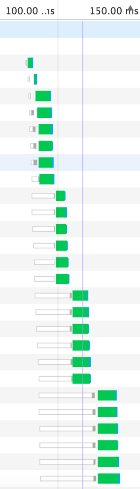

# http2express
a repo for learning how to use http2 in data interaction

## how to run
``` bash
npm start
```
to make a clear comparison, we also create http server in port 4000, in this way you can simultaneously open two website and observe how fast the http2 procotol can bring 

## initial steps

### create http2 certificate
```bash
$ openssl genrsa -des3 -passout pass:x -out server.pass.key 2048
$ openssl rsa -passin pass:x -in server.pass.key -out server.key 
$ openssl req -new -key server.key -out server.csr
$ openssl x509 -req -sha256 -days 365 -in server.csr -signkey server.key -out server.crt 
```
if the steps above all run correctly, you will have four files

`server.crt`

`server.csr`

`server.key`

`server.pass.key`

### create the fundamental framework of your server
I make framework with the `express-geerator`

```bash 
//you need to install the global express first
npm install express -g
express server
```

### choose plugins
there are two popular http2 plugins for nodejs, `http2`and`spdy`.Here we use `spdy`to write the test server because it is friendly to the `express` framwork.

```bash
npm install spdy --save
```

## comparison
the following two pic can show the difference between http2 and http.
http2 can download mutliply pic in one request. If you need to load huge number of pic, http2 is a great choice. However, I havn't know yet why the TTFB time in http2 is longer than http. 


